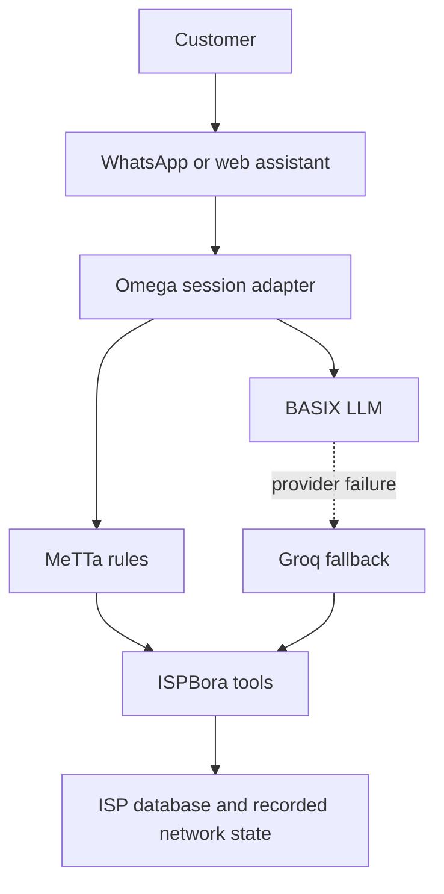

# ISPBora

## Project

ISPBora — The AI Operations Layer for Internet Service Providers.

## Problem

Small ISP teams run support, outages, and field work from scattered chats and spreadsheets. A customer can report that the internet has been down since morning, and the operator still has to find the account, check the area, decide whether a technician is needed, and write the reply. A general chatbot can sound helpful while inventing tickets, assignments, or repairs that never happened.

## Solution

ISPBora connects an operator console and a customer troubleshooting workflow to the ISP records that already exist: subscribers, service areas, incidents, support cases, technicians, and WhatsApp or SMS message rows.

The customer workflow does not let the language model decide the operational outcome on its own.

1. Python loads the subscriber, service area, connection status, and active incidents.
2. BASIX, when configured, writes the customer-facing sentence. Groq is the fallback if that call fails.
3. MeTTa rules choose the next operational decision from facts Python asserted.
4. Existing ISPBora tools create the support case or assign a technician only when that decision requires it.
5. The reply, facts, decision, and actions are stored. A WhatsApp reply is queued in the message log. It is not marked delivered, because this repository does not call a WhatsApp Business API.

## Architecture



Python still owns the database, APIs, message log, and every write. MeTTa does not run those side effects.

Groq remains available. If `BASIX_API_KEY` is missing, Groq is used directly. If BASIX times out, returns an error, or is rate limited, the same assistant call is retried on Groq. A failed `create_support_case` or assignment is an ISP operation failure. It does not switch providers, and the reply does not claim the write succeeded.

## BASIX

BASIX is an OpenAI-compatible API.

| Use | Endpoint |
| --- | --- |
| Chat | `https://llm.c.singularitynet.io/v1/chat/completions` |
| Embeddings | `https://llm.c.singularitynet.io/v1/embeddings` |

Configured model: `qwen/qwen3.8-27b`.

`qwen/qwen3.5-35b-a3b` was the requested default, but a live `GET /v1/models` on this endpoint did not list it, and a chat call returned `Model not found`. `qwen/qwen3.8-27b` is the available Qwen model, and a tool-call check returned `find_subscriber` correctly. `google/gemma-4-31b-it` and `openai/gpt-oss-20b` also returned that tool call. `minimax/minimax-m3` returned HTTP 429 during the same check.

Configured embedding model: `BAAI/bge-base-en-v1.5`. A live embeddings call returned a 768-number vector. The troubleshooting decision does not depend on that vector. The API key stays in `backend/.env` and is not sent to the dashboard or committed.

Environment variables, all server-side:

| Variable | Default |
| --- | --- |
| `BASIX_API_KEY` | empty |
| `BASIX_BASE_URL` | `https://llm.c.singularitynet.io/v1` |
| `BASIX_MODEL` | `qwen/qwen3.8-27b` |
| `BASIX_EMBEDDING_MODEL` | `BAAI/bge-base-en-v1.5` |
| `BASIX_TIMEOUT` | `25` seconds |

Other chat models returned by the live models endpoint during this work included `asi1`, `asi1-mini`, `deepseek/deepseek-v4-flash-0731`, `google/gemma-4-26b-a4b-it`, `google/gemma-4-31b-it`, `minimax/minimax-m3`, `minimax/minimax-m3-f`, `openai/gpt-oss-120b`, and `openai/gpt-oss-20b`. Embedding models on that list were `BAAI/bge-base-en-v1.5` and `WhereIsAI/UAE-Large-V1`. The catalog can change. Set `BASIX_MODEL` only to an id the endpoint currently serves.

This repository does not publish a numeric BASIX rate limit. HTTP 429, timeouts, transport errors, and malformed provider responses are treated as provider failures and fall back to Groq when Groq is configured.

## MeTTa

Rules live in `backend/apps/ai/isp_rules.metta`. Python asserts facts from stored records. The rule file returns decision symbols. Python then executes only the selected decision.

Facts the workflow can assert:

- `customer-active` or `customer-inactive`
- `service-active`, `service-degraded`, `service-outage`, or `service-inactive`
- `connection-online`, `connection-offline`, `connection-degraded`, or `connection-unknown`
- `incident-active` when an active incident exists for the area
- `diagnostics-not-run`, `diagnostics-success`, or `diagnostics-failed`

`diagnostics-success` means the stored connection is online, the area is operational, and no active incident is open. `diagnostics-failed` means the stored connection is offline or the area is in outage. ISPBora does not run a live network probe and does not claim a remote repair.

`balance-due` is a legal fact in the rule file, but Python never asserts it. ISPBora does not store balances, invoices, or M-Pesa transactions.

Decisions, in priority order:

| Decision | Rule |
| --- | --- |
| `human-escalation-required` | `customer-inactive` or `service-inactive` |
| `technician-required` | `connection-offline` and `diagnostics-failed`, or `service-outage` and `connection-offline` |
| `billing-action-required` | `balance-due` |
| `troubleshooting-required` | active customer with offline connection before diagnostics, degraded or unknown connection, degraded service, an active incident while the connection is still online, or a service-area outage |
| `service-appears-online` | `connection-online` and `diagnostics-success` |

The customer workflow reasons twice. The first pass asserts `diagnostics-not-run`. The second pass asserts the recorded diagnostic outcome and that decision is the one Python executes.

When the `hyperon` package imports, those queries run in Hyperon. PyPI does not provide a Windows wheel for current Hyperon builds, so on this machine the same `.metta` file is evaluated by a match interpreter in `backend/apps/ai/reasoning.py`. The interpreter only implements the `match` queries in that file.

## Omega

[Omega](https://github.com/singnet/Omega) is SingularityNET's MeTTa agent runtime. It expects a PeTTa checkout and its own MeTTa loop, NAL, and PLN libraries. That runtime is not installed inside this Django process, and this repository does not pretend that it is.

What is implemented is a session adapter, `OmegaSession`, with the same shape as one Omega turn:

1. Receive the customer message.
2. Recall the last few `AgentRun` rows for that subscriber.
3. Ask MeTTa for a decision.
4. Execute ISPBora tools.
5. Remember the facts, decision, provider, reply, and actions.

`omega.embedded_runtime` in the API response is `false`.

## Groq

Groq is the working fallback provider. The integration still uses `langchain_groq.ChatGroq` through `GroqChatModel`. Set `GROQ_API_KEY` and `GROQ_MODEL`. If BASIX is not configured, Groq handles the operator assistant and the customer wording directly. If neither provider is configured, the operator assistant returns HTTP 503 and the customer workflow still completes from the records, using a factual template instead of a model sentence.

## Demo

Primary customer workflow, from the assistant panel button **Customer demo** or from `POST /api/ai/customer/`:

```json
{
  "message": "Internet yangu imekuwa down tangu asubuhi.",
  "phone": "0712438221",
  "channel": "whatsapp"
}
```

`0712438221` is Mary Wanjiku in `python manage.py seed_demo`. She is an active subscriber in Kilimani, recorded offline, and included on incident `INC-104`. Brian Kamau is the only available Kilimani technician in that seed.

The workflow then:

1. Identifies Mary from the phone number.
2. Reads her plan, area, and connection.
3. Asks MeTTa before diagnostics and gets `troubleshooting-required`.
4. Reads the stored connection. It is offline, so the recorded diagnostic outcome is `diagnostics-failed`. No live probe is claimed.
5. Asks MeTTa again and gets `technician-required`.
6. Opens an `INTERNET_DOWN` support case, or reports the open case if one already exists. A failed write is reported as not created.
7. Assigns `INC-104` to Brian Kamau because exactly one available technician matches that area. If several match, nobody is assigned. If the incident already has a technician, the assignment is left unchanged.
8. Asks BASIX, then Groq, for one or two sentences. If the model claims a delivery, a new case, or an assignment the tools did not confirm, the factual template is kept.
9. Stores the inbound WhatsApp message and queues the outbound reply with status `PENDING`.
10. Saves an `AgentRun` row.

The assistant activity list shows customer identification, the connection check, both MeTTa decisions, the case, the assignment, and the queued reply.

Secondary operator question, answered from the subscriber table without calling a model:

`Show me customers whose internet is disconnected.`

The operator can also ask the assistant to explain a decision. `explain_subscriber_decision` runs the same MeTTa assessment and does not create a case or assign a technician.

## Setup

Python 3.12 or newer and Node.js 20 or newer.

### API

Windows:

```powershell
cd backend
python -m venv .venv
.\.venv\Scripts\Activate.ps1
pip install -r requirements.txt
copy .env.example .env
python manage.py migrate
python manage.py seed_demo
python manage.py runserver
```

macOS or Linux:

```bash
cd backend
python -m venv .venv
source .venv/bin/activate
pip install -r requirements.txt
cp .env.example .env
python manage.py migrate
python manage.py seed_demo
python manage.py runserver
```

Put `BASIX_API_KEY` and, if you want fallback wording, `GROQ_API_KEY` plus `GROQ_MODEL` in `backend/.env`. Do not commit that file.

On Linux or macOS, `pip install hyperon` enables the Hyperon engine for the same rule file. Leave it uninstalled where no wheel exists. The match interpreter still runs the rules.

The API is at `http://127.0.0.1:8000/`. `seed_demo` replaces previously seeded operational data, including saved agent runs.

### Dashboard

```bash
npm install
npm run dev
```

Open `http://127.0.0.1:5173/dashboard`. The dashboard calls `http://127.0.0.1:8000` unless `VITE_API_BASE_URL` is set.

## Testing

From `backend`, with the virtual environment active:

```bash
python manage.py check
python manage.py test
```

External BASIX and Groq calls are mocked. The customer workflow tests pass `model=False` or a stub model so they do not use the network.

From the repository root:

```bash
npx tsc --noEmit
npm run build
```

There is no separate frontend test runner.

## Environment

`backend/.env.example` lists every server variable: Django, the database, CORS, Africa's Talking, Groq, and BASIX. The root `.env.example` is only for the Vite dashboard and map tiles. It must not contain provider keys.

Never put a real API key in either example file, in frontend code, or in git.

## Hackathon track

AI Infrastructure Layer.

ISPBora qualifies by placing a provider boundary, a symbolic decision layer, and an agent session in front of real ISP operations:

- BASIX is the primary OpenAI-compatible model endpoint, including a configured chat model and an embeddings call.
- Groq stays behind that boundary as the working fallback.
- MeTTa rules in `isp_rules.metta` decide troubleshooting, technician dispatch, human escalation, or no field action from ISP facts.
- The Omega adapter persists each customer turn and recalls recent turns. The upstream Omega runtime is documented as not embedded.
- Django tools remain the only path that creates cases, assigns technicians, and queues WhatsApp replies.

## Stack

| Part | Technology |
| --- | --- |
| Dashboard | React, TypeScript, Vite, Tailwind CSS |
| API | Django, Django REST Framework |
| Local database | SQLite |
| Operator assistant | LangGraph, BASIX, Groq fallback |
| Customer decisions | MeTTa rules |
| Session memory | Omega adapter over `AgentRun` |
| Messaging | Africa's Talking USSD and SMS. WhatsApp replies are queued in the message log. |

## Project layout

```text
src/                         React dashboard
backend/apps/ai/             Assistant, BASIX and Groq providers, MeTTa rules, customer workflow
backend/apps/ai/isp_rules.metta
backend/.env.example         Server environment template
```

API paths, SMS setup, and incident actions are also documented in [backend/README.md](backend/README.md).

## Local access

The API currently allows unauthenticated requests so the console can be used in local development. Do not expose it on a public network without authentication.
